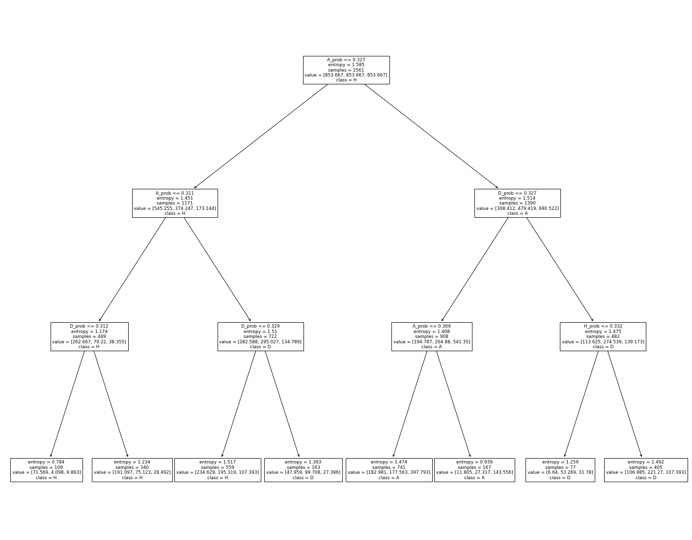

## Football matches result predictions

The aim of the project was to create a tool for predicting the results of league matches from the leading European leagues based on data prepared by myself.

The project was implemented _from scratch_, i.e. it included:
- collection of raw data on the basis of which it will be possible to create characteristics and then modeling
- creating variables based on i.a. time aggregates (last n matches), position in the table, team form, betting odds
- calculate historical data for modeling
- building the target solution: XGBoost model with 3 classes. Then, based on the estimated probability, a decision tree was created, which in a simple, rule-based way predicts which team will win the match (or a possible draw)
- creating a script that downloads data about upcoming matches with bookmaker odds (www.sts.pl), creating model variables for given teams and prediction of the match result.

Raw data with match results are downloaded from https://www.football-data.co.uk. <br>
The advantage of the approach is the ability to predict results from any league. But o far, it is possible to predict the results of the first league of the following countries:
- England
- Italy
- Germany
- Spain

Based on the raw data, I created the appropriate characteristics by myself. The full list of variables is available in the file: <a href="model/variables.md">variables</a>
<br>
<br>
The XGBoost model was built on a hand-prepared historical sample containing 3659 rows and 85 variables. As the objective function, `multi: softprob` was used so that the model's output was the probability of assigning observations to each of the 3 classes of match result - H (Home), A (Away), D (Draw).
<br>
These probabilities were then used to build a simple decision tree that would allow to categorize individual observations in a rule-based manner, i.e. to predict the final result with simple rules. This procedure allowed for the generalization of the results in such a way that the draw was not too rare (that was a problem - the draw practically did not occur). Below is the sheme of decision tree.
<br>


The forecasts are made on the basis of scraping information about the upcoming matches from the website www.sts.pl.
<br>
<br>
So far, no API has been developed that allows for the ongoing tracking of progzones and their results.
<br>
However, it is possible to clone the repository and use it with python.
```sh
git clone https://github.com/msoczi/football_predictions
```
You can use the package in two ways:
1. Interactive - via Jupyter Notebook - as the main function argument pass the name of the league for which you want to get forecasts. 
2. Run the <a href="main_script.py">main_script.py</a> from console e.g. 
```sh
python main_script.py
```
Then results will be saved to output.md file for league passed in the configuration file <a href="config.yaml">config.yaml</a>.


<br>
<br>
 
### Upcoming Premier League matches

| Date       | HomeTeam       | AwayTeam       |   pr_h_won |   pr_draw |   pr_a_won | prediction   |
|:-----------|:---------------|:---------------|-----------:|----------:|-----------:|:-------------|
| 2021-11-05 | Southampton    | Aston Villa    |   0.347455 |  0.326121 |   0.326424 | H            |
| 2021-11-06 | Man. Utd       | Man. City      |   0.331143 |  0.325841 |   0.343016 | A            |
| 2021-11-06 | Chelsea        | Burnley        |   0.379335 |  0.312232 |   0.308432 | H            |
| 2021-11-06 | Brentford      | Norwich        |   0.358447 |  0.327461 |   0.314092 | H            |
| 2021-11-06 | Crystal Palace | Wolverhampton  |   0.337877 |  0.328001 |   0.334122 | D            |
| 2021-11-06 | Brighton       | Newcastle      |   0.358938 |  0.32922  |   0.311842 | D            |
| 2021-11-07 | Everton        | Tottenham      |   0.335312 |  0.325365 |   0.339323 | A            |
| 2021-11-07 | Leeds          | Leicester      |   0.335849 |  0.327119 |   0.337032 | A            |
| 2021-11-07 | Arsenal        | Watford        |   0.371857 |  0.316939 |   0.311204 | H            |
| 2021-11-07 | West Ham       | Liverpool      |   0.333336 |  0.324075 |   0.342589 | A            |
| 2021-11-20 | Leicester      | Chelsea        |   0.329704 |  0.324095 |   0.346201 | A            |
| 2021-11-20 | Burnley        | Crystal Palace |   0.335648 |  0.329065 |   0.335288 | D            |
| 2021-11-20 | Aston Villa    | Brighton       |   0.334769 |  0.330178 |   0.335054 | D            |
| 2021-11-20 | Norwich        | Southampton    |   0.329278 |  0.325151 |   0.345571 | A            |
| 2021-11-20 | Wolverhampton  | West Ham       |   0.330044 |  0.326971 |   0.342985 | A            |
| 2021-11-20 | Watford        | Man. Utd       |   0.316094 |  0.31335  |   0.370556 | A            |
| 2021-11-20 | Newcastle      | Brentford      |   0.334014 |  0.32581  |   0.340176 | A            |
| 2021-11-20 | Liverpool      | Arsenal        |   0.374872 |  0.314853 |   0.310276 | H            |
| 2021-11-21 | Man. City      | Everton        |   0.377862 |  0.312954 |   0.309183 | H            |
| 2021-11-21 | Tottenham      | Leeds          |   0.348916 |  0.330153 |   0.320931 | D            |